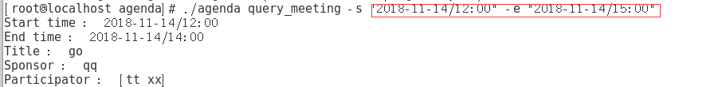

## 1.阶段一：测试Cobra

```
go get -v github.com/spf13/cobra/cobra
git clone https://github.com/golang/sys
git clone https://github.com/golang/text

//然后出现了错误
[janking@localserver cobra]$ go install ./cobra
../viper/viper.go:38:2: cannot find package "github.com/fsnotify/fsnotify" in any of:
	/usr/lib/golang/src/github.com/fsnotify/fsnotify (from $GOROOT)
	/home/janking/gowork/src/github.com/fsnotify/fsnotify (from $GOPATH)

//我用这个命令没成功，最后还是手动下载压缩包的放在上面错误提醒的相对目录就好了
git clone https://github.com/fsnotify/fsnotify

//进入相应的目录gowork/src/github.com/spf13/cobra/cobra
sudo go install ./cobra

//然后好大的一个坑，出现下列错误
[janking@localserver bin]$ ./cobra init
Error: Rel: can't make /home/janking/gowork/bin relative to 

//创建自己的github项目，然后进入里面创建agenda，在这个文件夹执行下列命令（目录gowork/src/github.com/JankingWon/agenda）
[janking@localserver agenda]$ ../../../../bin/cobra init
Your Cobra application is ready at
/home/janking/gowork/src/github.com/JankingWon/agenda

Give it a try by going there and running `go run main.go`.
Add commands to it by running `cobra add [cmdname]`.

//注册
../../../../bin/cobra add register
```

> **老师指导**：
>
> 修改 `register.go`, `init()` 添加：
>
> ```go
> registerCmd.Flags().StringP("user", "u", "Anonymous", "Help message for username")
> ```
>
> `Run` 匿名回调函数中修改为：
>
> ```go
> username, _ := cmd.Flags().GetString("user")
> fmt.Println("register called by " + username)
> ```
>
>


## 2.阶段二：编写agenda

```
[janking@localserver agenda]$ ../../../../bin/cobra init
Your Cobra application is ready at
/home/janking/gowork/src/github.com/JankingWon/agenda

Give it a try by going there and running `go run main.go`.
Add commands to it by running `cobra add [cmdname]`.

//然后通过下面的办法添加命令，并修改新生成的[命令].go文件
[janking@localserver agenda]$ ../../../../bin/cobra add [命令]
//接下来就是写代码了
```


- 把`cobra.out`文件放到`/gowork/bin`里面
- 删除所有`agenda`下面所有文件
- 进入文件夹`gopath/src/github.com/[Github用户名]/agenda`文件夹

- 初始化

  `[janking@localserver agenda]$ ../../../../bin/cobra init`

- 添加命令

  `[janking@localserver agenda]$ ../../../../bin/cobra add [命令]`

- 然后修改`cmd`下面的`[命令].go`文件（如`register.go`)

- 运行测试自己的命令

  `[janking@localserver agenda]$ go run main.go register -u janking`

- 生成可执行文件

  `[janking@localserver agenda]$ go build ./`

- 就可以这样执行命令了

  `[janking@localserver agenda]$ ./agenda register -u janking`

## 阶段三：代码测试

- 注册，登录，注销，退出命令的使用

##### 创建会议


##### 创建会议失败


##### 在冲突的时间创建会议


##### 查询会议



##### 取消会议


##### 清空会议


##### 退出会议


##### 总界面的help命令


##### 单一命令的help命令


##### 添加会议成员


- 用户信息成功保存


  # 任务分工


## 成员1：

cmd/带有meeting的五个文件

entity/Storage.go　ｄａｔｅ．ｇｏ

## 成员2：

cmd/带有log的三个文件

cmd/register.go

service/agendaservice.go,

## 成员3：

cmd/带有participater的两个文件

cmd/root.go

cmd/query_user.go

entity/除了Storage.go的四个文件


# 如何运行

- 把agenda文件夹 放到$GOPATH/src/ 下面 
- 运行 "go build ./" 生成 agenda.out
- 运行agenda.out 和 各种参数
