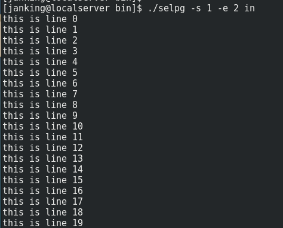
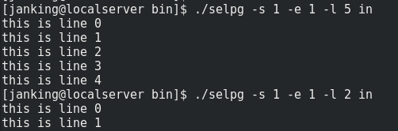
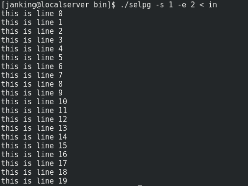
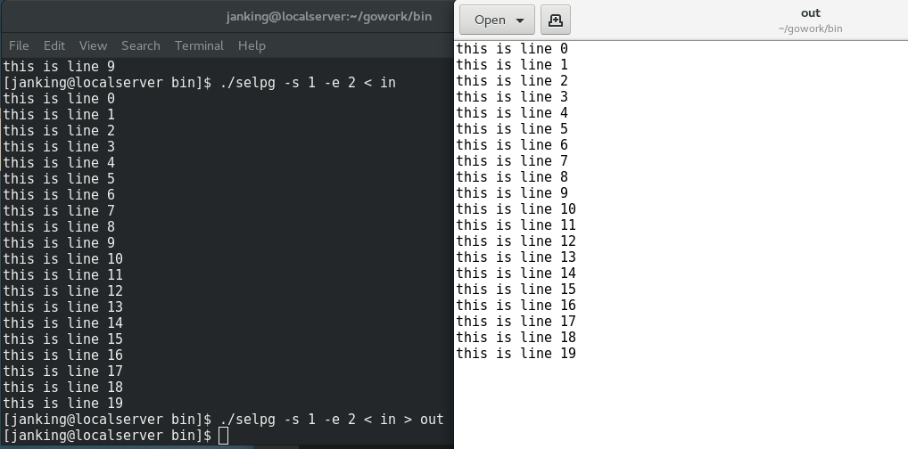
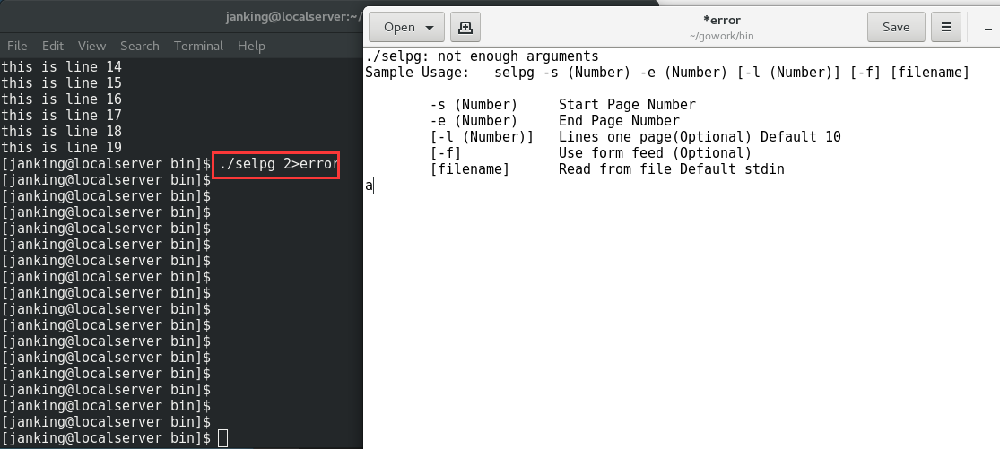
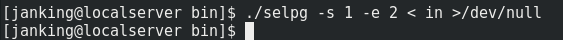
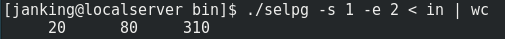

## 1.`./selpg -s 1 -e 2 in`

注：-s表示起始页，-e表示终止页，两个页都包括，从1开始计数，不能为0

默认每页是十行

## 2. `./selpg -s 1 -e 1 - l 5 in`

注：添加参数-l，表示每页5行

## 3. `./selpg -s 1 -e 2  < in`

注：将文件in作为输入流

## 4.`./selpg -s 1 -e 2  < in > out`

注：将输出定向到文件out中

## 5.`./selpg 2>error`

注：将错误重定向到error文件中

## 6.`./selpg -s 1 -e 2 < in >/dev/null`

注：将输出定向到空设备，所以输出和错误都被丢弃了

## 7.`./selpg -s 1 -e 2 < in >/dev/null`

注：标准输出被内核重定向到wc命令

显示选定范围的页中包含的行数、字数和字符数

